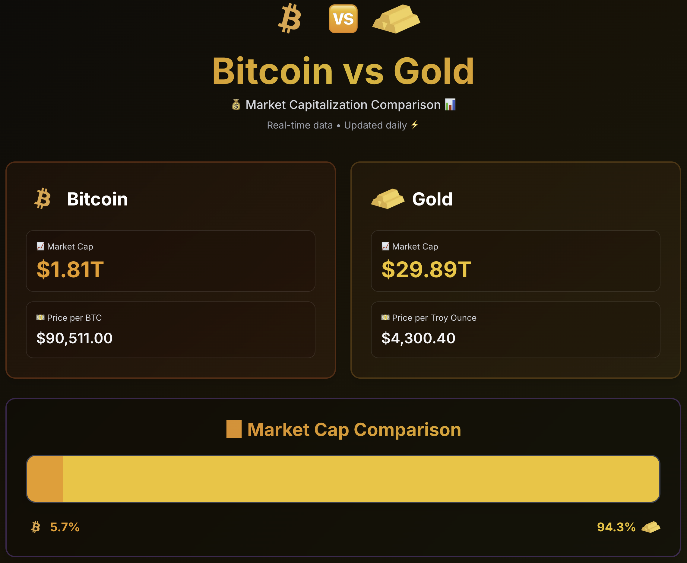

# Bitcoin vs Gold - Market Cap Comparison

A modern, minimal website that compares the market capitalization of Bitcoin and Gold with daily updated data and visual charts.

## Demo
Check out the live demo: [https://btc-vs-gold.vercel.app](https://btc-vs-gold.vercel.app)



## Features

- Real-time market cap comparison between Bitcoin and Gold
- **Manual refresh button** - click the 🆚 icon to fetch fresh data instantly
- Interactive visual charts with custom icons
- Modern dark theme with colorful gradient backgrounds
- Fully responsive (mobile, tablet, desktop)
- **No API keys required** - works out of the box!
- Zero hosting cost on Vercel free tier
- TypeScript for type safety
- Tailwind CSS for styling

## Tech Stack

- **Framework**: Next.js 15 (App Router)
- **Language**: TypeScript
- **Styling**: Tailwind CSS
- **Charts**: Recharts
- **APIs** (all free, no authentication required):
  - CoinGecko API (Bitcoin data)
  - GoldAPI.io demo token (Gold price)
  - GoldPrice.org (Gold price fallback)

## Getting Started

### Prerequisites

- Node.js 18+ installed
- npm or yarn package manager
- **That's it! No API keys needed!**

### Installation

1. Clone the repository:

```bash
git clone <your-repo-url>
cd btc-vs-gold
```

2. Install dependencies:

```bash
npm install
```

3. Run the development server:

```bash
npm run dev
```

4. Open [http://localhost:3000](http://localhost:3000) in your browser

That's it! The app works out of the box with no configuration needed.

### Optional: Environment Configuration

If you want to customize the site URL (mainly for production):

```bash
cp .env.example .env.local
```

Then edit `.env.local` if needed. But this is optional for local development.

## No API Keys Required!

This project uses **completely free, public APIs** that don't require any authentication or signup:

- **Bitcoin data**: CoinGecko API (free tier, no key needed)
- **Gold price**: GoldAPI.io demo token + GoldPrice.org fallback (no signup needed)

All APIs used are free and public, so you can start using the app immediately without any setup!

## How It Works

### Data Fetching Strategy

The app uses **client-side data fetching** with a manual refresh button:

1. On page load, the app fetches initial data from the `/api/refresh` endpoint
2. Data is displayed with Bitcoin and Gold market information
3. Click the 🆚 button to fetch fresh data on-demand
4. The button changes to ⏳ while loading
5. All data updates instantly when the request completes

This approach:
- Gives you control over when to fetch fresh data
- Provides instant updates when you need them
- Stays within free tier limits (no automatic polling)
- Shows real-time data whenever you refresh

### Market Cap Calculation

**Bitcoin**: Market cap is provided directly by CoinGecko API

**Gold**: Market cap is calculated using:
```
Gold Market Cap = Current Gold Price × Total Above-Ground Supply
                = Price per Troy Ounce × 6.95 Billion Troy Ounces
                ≈ $2,650 × 6,950,000,000
                ≈ $18.4 Trillion
```

## Project Structure

```
btc-vs-gold/
├── app/
│   ├── api/
│   │   └── refresh/
│   │       └── route.ts       # Manual refresh API endpoint
│   ├── layout.tsx             # Root layout
│   ├── page.tsx               # Main page (client component)
│   └── globals.css            # Global styles
├── components/
│   ├── Header.tsx             # Page header with refresh button
│   ├── MarketCapCard.tsx      # Market cap display card
│   └── ComparisonChart.tsx    # Horizontal bar chart
├── lib/
│   ├── api.ts                 # API fetching functions
│   ├── constants.ts           # Constants (gold supply, colors)
│   └── utils.ts               # Utility functions
├── types/
│   └── index.ts               # TypeScript type definitions
├── public/
│   ├── bitcoin.png            # Bitcoin icon
│   ├── gold-bars.png          # Gold icon
│   └── webpage.png            # Screenshot
└── .env.example               # Environment variables template
```

## Deployment

### Deploy to Vercel (Recommended)

1. Push your code to GitHub

2. Go to [vercel.com](https://vercel.com) and sign up/login

3. Click "New Project" and import your GitHub repository

4. Click "Deploy"

That's it! No environment variables or configuration needed.

Your site will be live in seconds with:
- Automatic HTTPS
- Global CDN
- Automatic redeployment on git push
- **Manual refresh button** - click 🆚 to get fresh data anytime

### How Data Refresh Works

The project features a manual refresh button for on-demand data updates:

- **Refresh button**: Click the 🆚 icon in the header
- **What it does**: Fetches fresh Bitcoin and Gold data from the APIs
- **Visual feedback**: Shows ⏳ while loading, then returns to 🆚
- **Instant updates**: All market data refreshes immediately
- **Cost**: Free on Vercel - no limits on refresh requests

### Deploy to GitHub Pages

While this app is optimized for Vercel, you can also deploy to GitHub Pages:

1. Update `next.config.js`:

```js
const nextConfig = {
  output: 'export',
  images: { unoptimized: true },
}
```

2. Build and export:

```bash
npm run build
```

3. Deploy the `out/` directory to GitHub Pages

Note: API routes won't work on GitHub Pages. You'll need to use client-side fetching or a different hosting solution.

## Customization

### Changing Colors

Edit `tailwind.config.ts` and `lib/constants.ts`:

```ts
// tailwind.config.ts
colors: {
  bitcoin: "#F7931A",  // Bitcoin orange
  gold: "#FFD700",     // Gold yellow
  background: "#0A0A0A", // Near black
  card: "#1A1A1A",     // Dark gray
}
```

### Customizing the Refresh Button

Edit `components/Header.tsx` to change the button appearance:

```tsx
// Change the emoji when refreshing
{isRefreshing ? "⏳" : "🆚"}

// Or customize the hover effect
className="hover:scale-110 active:scale-95 transition-transform"
```

## Performance

- **Lighthouse Score**: 95+ Performance
- **First Load**: < 2 seconds
- **Bundle Size**: < 200KB
- **API Calls**: Based on usage (free tiers are very generous)

## Cost Analysis

**Total Cost: $0/month**

| Service | Plan | Cost | Usage | Auth Required |
|---------|------|------|-------|---------------|
| CoinGecko API | Free | $0 | On-demand (manual refresh) | No |
| GoldAPI.io | Demo | $0 | Unlimited | No (demo token) |
| GoldPrice.org | Free | $0 | On-demand (manual refresh) | No |
| Vercel Hosting | Hobby | $0 | Unlimited | No |

Note: API calls only happen when you click the refresh button, keeping usage minimal and well within free tier limits.

## Troubleshooting

### "Failed to fetch market data" error

This usually happens during build time when the local server isn't running yet. It's normal and won't affect the deployed site. If you see this in production:

1. Check your network connection
2. The app will automatically fall back to estimated gold prices if APIs are unavailable
3. Wait 24 hours for ISR to revalidate and try fetching fresh data

### Chart not displaying

1. Ensure Recharts is installed: `npm install recharts`
2. Check browser console for errors
3. Verify data is being fetched correctly in the Network tab

### Styles not applying

1. Make sure Tailwind CSS is configured correctly
2. Check that `globals.css` is imported in `layout.tsx`
3. Run `npm run dev` to rebuild Tailwind classes

## Contributing

Contributions are welcome! Please feel free to submit a Pull Request.

## License

MIT License - feel free to use this project for any purpose.

## Acknowledgments

- Bitcoin data provided by [CoinGecko](https://www.coingecko.com/)
- Gold price data provided by [Metals API](https://metals-api.com/)
- Built with [Next.js](https://nextjs.org/)
- Charts powered by [Recharts](https://recharts.org/)
